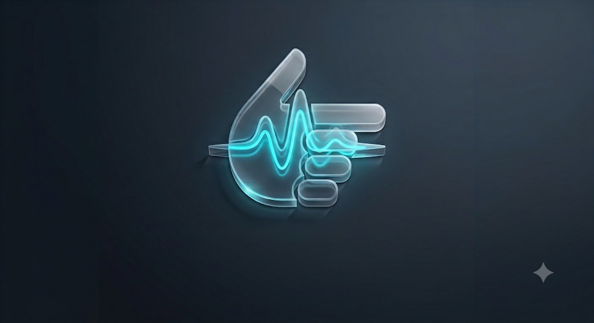
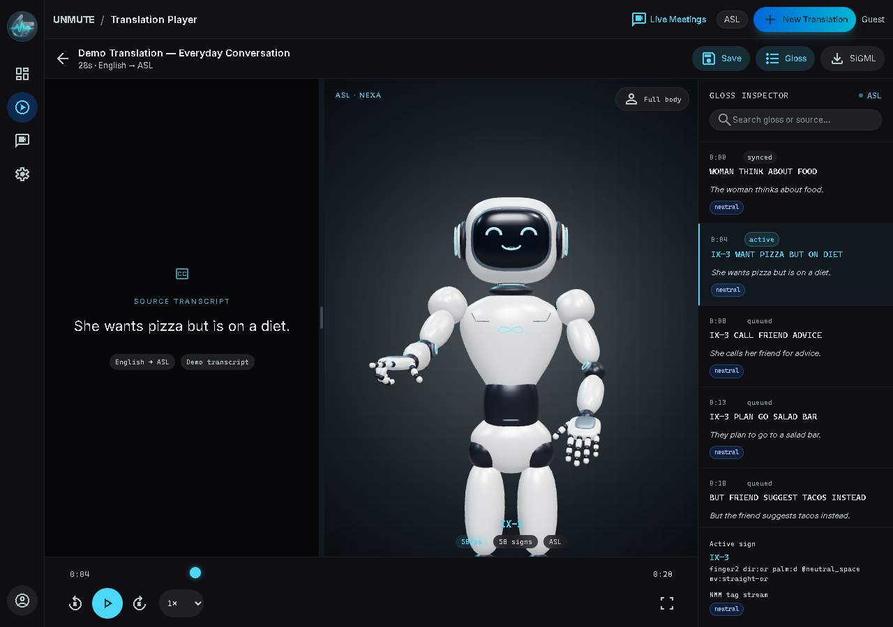
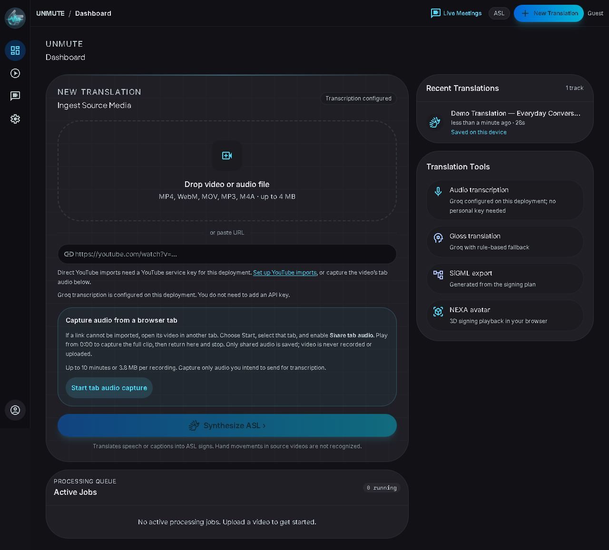
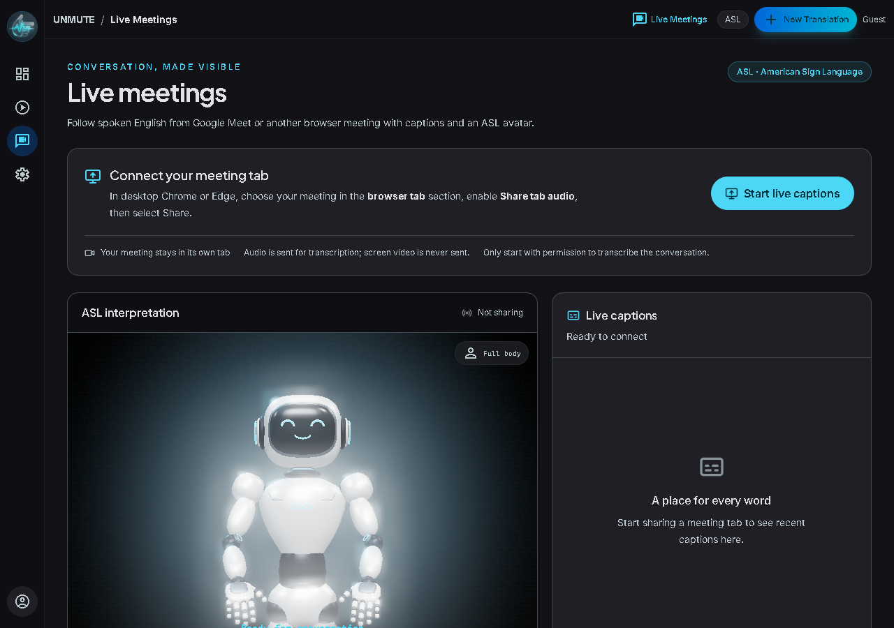
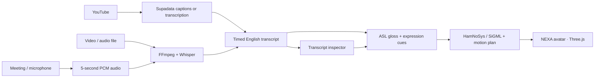

<p align="center">
  
</p>

<h1 align="center">UNMUTE</h1>
<p align="center"><strong>Make spoken moments visible.</strong></p>
<p align="center">YouTube videos, recordings and live conversations → captions and a 3D ASL avatar.</p>

<p align="center">
  <a href="https://unmute-ai.vercel.app"><strong>Open UNMUTE</strong></a> &nbsp;·&nbsp;
  <a href="https://unmute-ai.vercel.app/player/demo"><strong>Try the instant demo</strong></a> &nbsp;·&nbsp;
  <a href="https://unmute-ai.vercel.app/live">Live Meetings</a> &nbsp;·&nbsp;
  <a href="UNMUTE_Editable_Pitch_Deck.pptx">Editable pitch deck</a>
</p>

<p align="center"><sub>Next.js 16 · React 19 · TypeScript · Three.js · Groq / Whisper · Supadata · Supabase · Vercel</sub></p>

---

## The idea

A lecture, a tutorial, a conversation: so much information starts as speech. UNMUTE explores another way to follow it, bringing captions and an animated signing avatar into the same workspace.

Import media, inspect the transcript, watch the NEXA avatar articulate the generated ASL plan, and replay the moments you want to understand. For live conversations, choose meeting audio, your microphone, or both. The optional Firefox add-on brings the experience into a floating Google Meet widget.

**Built for Deaf and hard-of-hearing accessibility, with an inspectable path from source speech to signing.** UNMUTE is a working hackathon prototype; its generated ASL still needs evaluation with fluent signers and the people it is designed to support.



## Try it in two minutes

| Step | What to do | What to look for |
| --- | --- | --- |
| **1 · Watch** | Open the [instant demo](https://unmute-ai.vercel.app/player/demo) and press Play. No account or key needed. | Articulated arms, hands and fingers alongside the source transcript. |
| **2 · Explore** | Seek, change playback speed, and edit a source sentence in the inspector. | Playback follows your controls; correcting the transcript regenerates its signing plan. |
| **3 · Speak** | Open [Live Meetings](https://unmute-ai.vercel.app/live), choose **My microphone**, allow access and speak. | An input meter, English captions and queued ASL signing. Allow five seconds of audio plus processing time. |
| **4 · Keep it** | Choose **Save** in the player, then reopen the track from the dashboard. | The source media, transcript, signing plan and playback position survive a reload on the same browser. |

**Testing your own voice? Choose My microphone.** Meeting-tab audio captures the sound played by that tab. No extension is needed for the website demo or Live Meetings page.

## One experience, three ways in

| Recorded media | YouTube | Live conversations |
| --- | --- | --- |
| Upload MP4, WebM, MOV, MP3 or M4A. | Paste a public video URL. | Choose meeting audio, microphone, or both. |
| Review the original media with native playback controls. | Retrieve captions, or request speech transcription when captions are unavailable. | Follow timestamped captions and a separate **Now signing** view. |
| Edit the transcript, replay signs and save your work. | Translate non-English captions into English before ASL planning. Hindi was verified end to end. | Stop sharing to release audio access and finish queued speech. |

<table>
  <tr>
    <td width="50%"></td>
    <td width="50%"></td>
  </tr>
  <tr>
    <td align="center"><strong>Bring your own media</strong></td>
    <td align="center"><strong>Follow the conversation</strong></td>
  </tr>
</table>

## What makes the build interesting

**You can inspect the translation.** Source text, ASL gloss, expression markers and the active sign are visible together. Correcting a misheard word changes the generated plan. SiGML export makes the notation available beyond the player.

**The avatar has a motion plan.** Dictionary signs and fingerspelled vocabulary become timed articulation with transitions, readable holds and non-manual expression cues. Seeking is deterministic; playback controls affect both media and signing. Dense passages can take longer to sign, and the player shows that extra time.

**Live audio has a complete lifecycle.** Five-second PCM WAV segments are independently decodable. The input meter distinguishes silence, muted input and processing problems. Bounded queues prevent unlimited backlog; Stop finishes pending speech, Cancel discards it, and hiding the avatar preserves its signing position.

**The pipeline handles imperfect conditions.** YouTube imports can generate transcripts without existing captions. Long translations retain completed work through provider quota delays. Text-model fallbacks respect reset times instead of repeatedly calling an exhausted model.

## From speech to signs



| Layer | Implementation |
| --- | --- |
| **Application** | Next.js App Router, React, TypeScript and Tailwind CSS |
| **Speech and ingestion** | Supadata for hosted YouTube imports; FFmpeg and Whisper via Groq or OpenAI for speech |
| **Translation** | AI-assisted ASL glossing with local-rule fallback; bounded caption translation with preserved timestamps |
| **Motion** | Three.js, the NEXA rig, sign dictionaries, fingerspelling and timed expression markers |
| **Persistence** | IndexedDB for device saves; Supabase for authentication, account transcripts and uploaded media |
| **Live overlay** | Firefox extension with shared website UI, authenticated runtime messaging and one capture owner |
| **Deployment** | Vercel; provider credentials stay on the server |

## Built, tested, measured

Verification recorded on **13 September 2026**:

| Evidence | Result |
| --- | --- |
| **Website interaction checks** | 46 affected browser cases passed, including one isolated retry of a synthetic audio-startup timeout. Native MP4 and older saved-plan recovery checks also passed. |
| **Actual Firefox runtime** | Three installed-add-on tests passed with real synthetic WebRTC, audio worklets, independently decoded WAVs and capture cleanup. |
| **Avatar movement** | Compiled-widget tests measured arm, hand and finger motion, hidden pause/resume, Stop draining and stale-response cancellation. |
| **Real Hindi source** | All 826 captions translated with original timestamps retained; 19,074 planned signs preserved. |
| **Long-video timing repair** | Signing duration reduced from roughly **70m14s to 46m33s** for a **45m22s** source. About 71 seconds of extra signing remains; this is a timing result, not an accuracy score. |
| **Cloud upload** | A signed-in production MP4 uploaded to Supabase, played, and reopened with its transcript in a fresh tab. |
| **Build quality** | Production build, TypeScript, ESLint and pipeline/unit checks passed. |

See the [verification report](docs/TEST_REPORT.md) and [implementation tracker](extension/AgentFixThis.md) for scope and remaining checks. Synthetic meeting tests do not replace a real participant call or an ASL-fluent review.

## Run it locally

Use **Node.js 22.x**:

```sh
git clone https://github.com/walshdsouza/Bit-n-Build.git
cd Bit-n-Build
npm ci
npm run dev -- --port 3111
```

Open [localhost:3111/player/demo](http://localhost:3111/player/demo). **The built-in demo needs no environment file.**

For imports and live speech, create `.env.local`:

```dotenv
# Configure Groq or OpenAI for speech and optional AI translation
GROQ_API_KEY=
OPENAI_API_KEY=

# Hosted YouTube imports
SUPADATA_API_KEY=

# Optional account integration
NEXT_PUBLIC_SUPABASE_URL=
NEXT_PUBLIC_SUPABASE_ANON_KEY=
```

Restart the server after changing configuration. Keep provider secrets out of Git and client bundles. Device saves work without Supabase; account integration requires its tables, bucket and access policies.

[Full setup, API reference, tests and deployment guide →](docs/DEVELOPMENT.md)

## Floating Google Meet widget

The **optional Firefox add-on** places UNMUTE inside Google Meet. Move it, resize it, minimize it, or reopen it while retaining the shared live-caption and signing experience. Users do not enter API keys.

```sh
cd extension
npm ci
npm run build
```

Load `extension/manifest.json` through Firefox's `about:debugging#/runtime/this-firefox` → **Load Temporary Add-on**, then reload Meet. Temporary installation lasts until Firefox restarts; permanent distribution requires Mozilla signing.

[Installation guide](extension/README.md) · [Privacy and audio handling](extension/store/PRIVACY.md)

## Current boundaries and next steps

- **ASL is the product's current output.** Source speech becomes English captions; this is not automatic sign-language identification or sign-to-text recognition.
- **Translation remains a prototype.** Vocabulary is limited, unfamiliar words are fingerspelled, and fluent-signer evaluation is still needed. UNMUTE is not a replacement for a qualified interpreter.
- **Access and quotas matter.** Public YouTube imports depend on provider availability and video restrictions. Dashboard uploads are limited to 4 MB; recorded tab capture to 10 minutes or 3.8 MB.
- **Storage has two scopes.** Save keeps a track in the current browser. Account imports can persist to Supabase; the current media bucket serves individual file URLs publicly. Clearing browser data removes device saves.
- **Next milestones:** co-design and evaluation with Deaf ASL users, broader validated vocabulary, phrase-level timing improvements, and verification in real meetings before permanent extension distribution.

## Explore the project

| Resource | Link |
| --- | --- |
| Product | [Live application](https://unmute-ai.vercel.app) · [Demo](https://unmute-ai.vercel.app/player/demo) |
| Presentation | [Manually editable PowerPoint](UNMUTE_Editable_Pitch_Deck.pptx) |
| Engineering | [Development guide](docs/DEVELOPMENT.md) · [Architecture](docs/ARCHITECTURE.md) |
| Evidence | [Test report](docs/TEST_REPORT.md) · [Fix tracker](extension/AgentFixThis.md) |
| Extension | [Source and setup](extension/README.md) · [Reviewer instructions](extension/store/SOURCE_SUBMISSION.md) |

### Acknowledgments

UNMUTE builds on the included [NEXA implementation kit and its license](public/models/NEXA-LICENSE.txt). [Kozha](https://github.com/zhan-a/Kozha) informed the HamNoSys/SiGML notation approach; [GenASL](https://github.com/sanaro99/GenASL) informed prosody-aware motion planning. Refer to the relevant upstream licenses when reusing their assets or implementations.

<p align="center"><strong>Bring the conversation into view.</strong><br /><a href="https://unmute-ai.vercel.app/player/demo">Try UNMUTE →</a></p>
