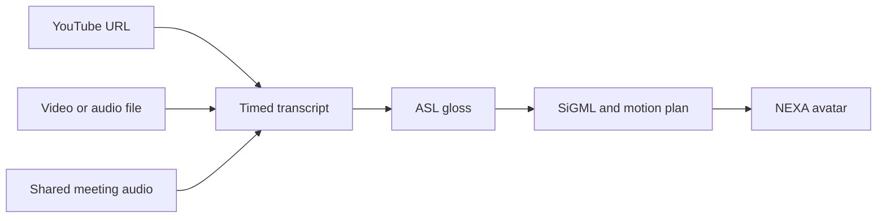

# UNMUTE development guide

[Back to the project overview](../README.md)

## Run locally

**Requirements:** Node.js **22.x**, npm, and an internet connection for dependency installation and the first development/build run.

```sh
git clone https://github.com/walshdsouza/Bit-n-Build.git
cd Bit-n-Build
npm ci
npm run dev -- --port 3111
```

Open [localhost:3111](http://localhost:3111), or go straight to the [demo player](http://localhost:3111/player/demo). Port `3111` matches the repository's API and browser test defaults. Running `npm run dev` without a port uses Next.js's default port, `3000`.

No environment file is needed for the demo. To import media or use Live Meetings, configure the relevant services below and restart the development server.

FFmpeg is supplied by the app's dependencies. On Windows x64 and Linux x64, `predev` and `build` also download and verify a pinned official yt-dlp binary for the local YouTube fallback. Other local platforms skip that downloader; hosted Supadata imports do not depend on it.

## Configure services

Create `.env.local` in the repository root. Fill only the values required for the features you want to run:

```dotenv
# Speech transcription and optional AI gloss translation
GROQ_API_KEY=
OPENAI_API_KEY=

# Hosted YouTube caption retrieval and audio transcription
SUPADATA_API_KEY=

# Optional Supabase authentication and account storage
NEXT_PUBLIC_SUPABASE_URL=
NEXT_PUBLIC_SUPABASE_ANON_KEY=
```

| Capability | Required configuration |
| --- | --- |
| Demo and rule-based text translation | None |
| YouTube URL imports on Vercel | `SUPADATA_API_KEY`; non-English captions also need a server Groq or OpenAI key |
| Uploaded media and recorded tab audio | **Server-side** `GROQ_API_KEY` or `OPENAI_API_KEY` |
| Live Meetings | **Server-side** `GROQ_API_KEY` or `OPENAI_API_KEY` |
| AI-assisted gloss translation | Groq or OpenAI key; local rules remain the fallback |
| Save on this device | IndexedDB support; no account or database required |
| Authentication and account history | Supabase configuration, database schema, storage and access policies |

### Provider keys

Groq is preferred when both Groq and OpenAI are configured. OpenAI is used when no Groq key is available; transcription does not automatically switch providers after a failed request.

Caption translation and AI glossing use a bounded Groq fallback chain: `openai/gpt-oss-120b`, `openai/gpt-oss-20b`, then the available preview model `qwen/qwen3.8-27b`. Caption IDs preserve original timing. Provider reset times are respected, and long YouTube translations retain completed work in signed continuation tokens between requests. Longer quota delays show when to retry; an ordinary import waits for up to eight minutes. Retrying the same URL resumes saved progress until the token expires after one hour.

The website uses server credentials for imports, speech translation and Live Meetings. The Firefox extension uses the hosted UNMUTE live endpoint. Users do not need to provide API keys in either interface.

`.env.local` is ignored by Git. Provider secrets belong in server environment variables, without a `NEXT_PUBLIC_` prefix. The two Supabase variables above are public client configuration.

### Optional Supabase setup

Supabase is separate from the player's **Save** feature. Guest translations and device saves work without it.

The account integration expects `projects` and `transcript_segments` tables and a `media` storage bucket. [Storage setup SQL](setup-media-storage.sql) creates the media bucket and account-owned write policies. The bucket serves individual media URLs publicly, matching the current player architecture. Complete database migrations are not included, so public credentials alone do not provision the project tables. Authentication redirects and appropriate access policies also need to be configured in the Supabase project.

The client reads the public key from `NEXT_PUBLIC_SUPABASE_ANON_KEY`; a separately named `NEXT_PUBLIC_SUPABASE_PUBLISHABLE_KEY` variable is not read by the current code.

## Use the app

### Translate a recording or YouTube video

1. Open **Dashboard** and upload a video/audio file or paste a public YouTube URL.
2. Select **Synthesize ASL**. Longer YouTube imports show progress while transcription is prepared.
3. In the player, use the timeline and speed controls to review the result. Edit source text in the gloss inspector to regenerate signs.
4. Choose **Save** to keep the track on this device, or **SiGML** to download its sign notation.

Saved tracks belong to the current browser and website address. Clearing browser data removes them; they are not synchronized across devices.

### Capture audio from a browser tab

1. Open the source video in another tab in desktop Chrome or Edge.
2. On the dashboard, choose **Start tab audio capture**.
3. Select the source tab and enable **Share tab audio**.
4. Play the source, stop recording, review the audio, then select **Synthesize ASL**.

Only the shared audio is recorded. Screen video is not uploaded. Capture stops at ten minutes or the recording-size limit.

### Follow a live meeting

1. Open **Live Meetings** and choose **Meeting tab** for other participants, or **My microphone** to translate your own voice without a meeting.
2. For a meeting, select **Include my microphone** if your own words should also be translated.
3. Select **Start live captions** and allow the requested audio access. For tab sharing, use desktop Chrome or Edge and enable **Share tab audio**.
4. Check the audio level indicator, then speak or play the meeting audio. Captions and signs appear after a few seconds.
5. Keep UNMUTE beside your meeting. Select **Stop sharing** when finished; both tab and microphone access are released.

Live captions arrive after five-second audio windows and transcription processing. Microphone access is requested only when explicitly selected. The screen distinguishes silence from transcription delays and provides a retry on failure. Signing waits for the avatar to load and pauses while the tab is hidden, then resumes when you return. Recent captions remain on the page until you start again or leave.

## How it works



Supadata handles hosted YouTube ingestion with `mode=auto`: it retrieves existing captions or generates a transcript from speech when captions are unavailable. Non-English captions are translated in bounded batches with per-caption IDs; their original timestamps are retained. Uploaded media passes through FFmpeg and Whisper's speech-to-English endpoint; live audio uses the same endpoint with independent WAV segments. The translation layer applies language rules or AI glossing, builds HamNoSys/SiGML notation, and creates a timed motion plan. Timing and text cues guide articulation and non-manual markers.

The player uses the source media as its clock when available and a motion-plan clock otherwise. Unknown vocabulary is fingerspelled. The library retains ASL, ISL and experimental BSL profiles for development, while the web interface uses ASL.

**Stack:** Next.js 16 · React 19 · TypeScript · Tailwind CSS 4 · Three.js · Supadata · Whisper via Groq/OpenAI · optional Supabase · Vercel

```text
app/                     Pages, authentication and API routes
components/dashboard/    Media ingestion, tab capture and saved history
components/player/       Timeline, transcript inspector and 3D avatar
components/live/         Meeting audio capture, request queue and captions
components/marketing/    Landing-page components
lib/                     Transcription, glossing, notation and motion planning
lib/dictionaries/        Sign vocabulary and language data
utils/supabase/          Optional authentication and database clients
public/                  Branding, screenshots and the NEXA model
scripts/                 Downloader preparation and demo recording
extension/               Firefox Meet widget and sidebar using hosted transcription
tests/                   Pipeline, API and browser tests
```

## API

| Route | Input and result |
| --- | --- |
| `POST /api/process-video` | JSON YouTube `url` or multipart `file` → timed transcript, or a pending import |
| `POST /api/transcribe` | Multipart audio `file` → Whisper transcript |
| `POST /api/live` | Multipart short PCM WAV `audio` → captions and an ASL plan |
| `POST /api/translate` | Transcript `segments` → gloss rows, SiGML and motion plan |
| `POST /api/gloss` | Transcript `segments` → gloss rows and estimated prosody |
| `POST /api/sigml` | `glossRows` → SiGML and motion plan |
| `GET /api/sign-languages` | Language profiles and availability metadata |

For example, send this JSON to `POST /api/translate`:

```json
{
  "lang": "ASL",
  "segments": [
    { "start": 0, "end": 3, "text": "Hello my friend." }
  ]
}
```

`/api/translate` returns `glossRows`, `plan`, `sigml` and `stats`. AI-generated wording can vary; the rule engine is deterministic.

YouTube imports may return HTTP `202` with a `jobToken`. Poll by posting the same `url` and that token to `/api/process-video`; do not start a new job on every poll. `/api/ingest` is a compatibility alias. The legacy `/api/status/:jobId` route does not poll Supadata jobs.

Ordinary transcription/translation endpoints accept the applicable `x-groq-api-key`, `x-openai-api-key` or `x-supadata-api-key` headers. `/api/live` uses server credentials only.

## Development and tests

| Command | Purpose |
| --- | --- |
| `npm run dev` | Start the development server |
| `npm run build` | Prepare the downloader and create a production build |
| `npm run start` | Serve a completed production build |
| `npm run lint` | Run ESLint |
| `npm test` | Run pipeline, timing, motion, media, live-audio and provider tests without a server |
| `npm run test:api` | Run HTTP integration checks against a running app |
| `npm run test:browser` | Run Playwright checks against a running app |

For API and browser checks, keep the app running on port `3111` in another terminal. Playwright does not start the server automatically.

```sh
npm test
npm run lint
npx tsc --noEmit
npx playwright install chromium
npm run test:browser
```

Run `npm run test:api` against a server without Groq/OpenAI keys for deterministic grammar and missing-key assertions. `API_HAS_TRANSCRIPTION_KEY=1` skips missing-key assertions when testing a configured server, but does not make remote AI output deterministic.

Optional environment variables:

| Variable | Purpose |
| --- | --- |
| `API_BASE_URL` | API test server; defaults to `http://localhost:3111` |
| `PLAYWRIGHT_BASE_URL` | Browser test server; defaults to `http://localhost:3111` |
| `PLAYWRIGHT_CHANNEL` | Use an installed browser, such as `msedge` |
| `UI_TEST_SERVER_PROVIDER` | Set to `groq`, `openai` or `none` to check the displayed transcription configuration |
| `API_TEST_YOUTUBE=1` | Include a real public YouTube import in the API suite; requires provider access |

In PowerShell, set variables with `$env:NAME='value'` before running a command. The release browser suite writes its results under `logs/`.

To serve a local production build:

```sh
npm run build
npm run start -- --port 3111
```

The optional `scripts/record-demo.mjs` and `scripts/finalize-demo.mjs` scripts record a captioned demo. Final video encoding additionally requires `ffmpeg` on your system `PATH`.

## Deploy to Vercel

1. Import the repository into Vercel, or link it with the CLI below.
2. Use the **Next.js** preset, repository root, and **Node.js 22.x**.
3. Add the required server keys from [Configure services](#configure-services) to the production environment. Add Supabase variables only if that integration has been provisioned.
4. Deploy using `npm run build`. After changing server environment variables, create a new deployment.
5. Open the production domain. The root route `/` is the public landing page.

```sh
npx vercel login
npx vercel link
npx vercel deploy --prod
```

`.vercelignore` excludes local logs, test artifacts and the Firefox extension from website deployments. Native media dependencies are included through `next.config.ts` file tracing.

## Limits and troubleshooting

| Situation | What to check |
| --- | --- |
| YouTube import is not configured | The site owner should set `SUPADATA_API_KEY` on the server and redeploy. |
| A video cannot be imported | Check that it is public and has usable speech/captions. Supadata can generate transcripts without a caption track, but provider plans, quotas and access restrictions still apply. Try tab audio capture or a file upload. |
| Speech translation unavailable | The site owner should check the server's Groq/OpenAI credentials and provider limits. Long non-English videos can take longer because captions must also be translated. |
| Live Meetings cannot hear your own voice | Choose **My microphone**, or select **Include my microphone** alongside **Meeting tab**. Tab audio alone excludes your own microphone. |
| Live Meetings cannot transcribe | Check the audio level and selected source. A **server** transcription key is required. A stalled request stops with a retry instead of waiting indefinitely. |
| A saved track is missing | Use the same browser and website address where it was saved. Browser data clearing removes local tracks. |
| A YouTube playback rate is unavailable | The player reports the video's supported rate instead of claiming the requested rate was applied. |

- **Uploads:** the dashboard and Vercel routes accept files up to **4 MB**. The local ingestion API accepts larger files, but this does not increase the dashboard's limit.
- **Tab recordings:** capped at **10 minutes or 3.8 MB**. Live Meetings processes short segments and stops sharing if its bounded queue falls too far behind.
- **Signing quality:** limited by the dictionary, translation rules and generated plan. Software tests do not certify every sign's linguistic accuracy; dense or unfamiliar speech can require additional signing time.
- **Source language:** speech is translated to English for ASL signing. Hindi captions require the server's text-translation provider; English captions can use local gloss rules. Translation quality depends on clear speech, source captions and the provider. The app does not infer a target sign language from the source audio or interpret visible signing gestures.

For local development without Supadata, an optional Python caption fallback is available through `python -m pip install youtube-transcript-api`. Set `PYTHON_PATH` only if a specific interpreter is needed. This fallback is skipped on Vercel.

## Firefox extension

`extension/` contains the UNMUTE Firefox add-on for Google Meet. Its floating NEXA widget and sidebar share the website's live-caption queue and avatar playback. Choose **Meeting audio**, **My microphone**, or **Meeting + microphone**; an input meter, timestamped caption history, and **Now signing** show what is being heard and performed. Transcription uses the hosted UNMUTE endpoint; no personal API key is needed. The web app's Live Meetings feature also works without the extension.

With Node.js 22:

```sh
cd extension
npm ci
npm run build
```

In Firefox, open `about:debugging#/runtime/this-firefox`, choose **Load Temporary Add-on**, and select `extension/manifest.json`. Temporary add-ons must be loaded again after Firefox restarts.

Reload an open Meet tab after loading the add-on, choose the audio source, then press **Start**. Microphone sources request permission explicitly. Independent five-second WAV recordings are sent for English captions and ASL signs. **Stop** releases capture and finishes queued audio and signing; **Cancel** discards pending work.

Drag or resize the widget, or use its keyboard handles. **Hide** and **Minimize** keep capture running while pausing avatar playback; reopen to resume. Only one extension view owns meeting capture at a time, and closing its frame releases ownership. Keep a Meet tab active when starting from the sidebar. To try your microphone outside Meet, use the hosted Live Meetings link in extension Settings.

Controlled tests cover the shared UI, native audio, ownership and avatar movement. Firefox 155 checks install the add-on and exercise real WebRTC, audio worklets and extension ports against a controlled meeting fixture. A Google Meet call with real participant speech remains a separate release verification.

See [build instructions](../extension/README-BUILD.txt), [reviewer/source instructions](../extension/store/SOURCE_SUBMISSION.md), and the [extension privacy policy](../extension/store/PRIVACY.md) for details and packaging commands.

## Documentation and credits

- [Current fix tracker](../extension/AgentFixThis.md) — completed changes, remaining issues and verification steps.
- [Architecture](ARCHITECTURE.md) — notation, language profiles and pipeline design; some internal names predate UNMUTE.
- [Test report](TEST_REPORT.md) — release validation, real-service checks and current limitations.
- [NEXA license](../public/models/NEXA-LICENSE.txt) — attribution and terms for the included NEXA implementation kit.
- Design references: [Kozha](https://github.com/zhan-a/Kozha) for the HamNoSys/SiGML pipeline and [GenASL](https://github.com/sanaro99/GenASL) for prosody-aware avatar planning.

